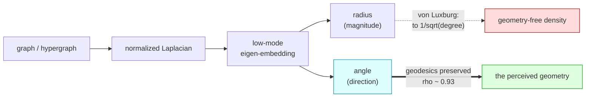
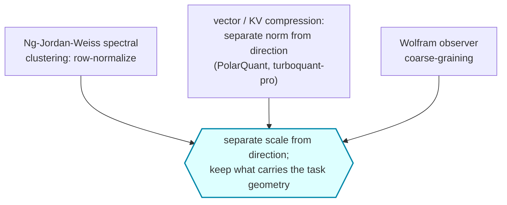
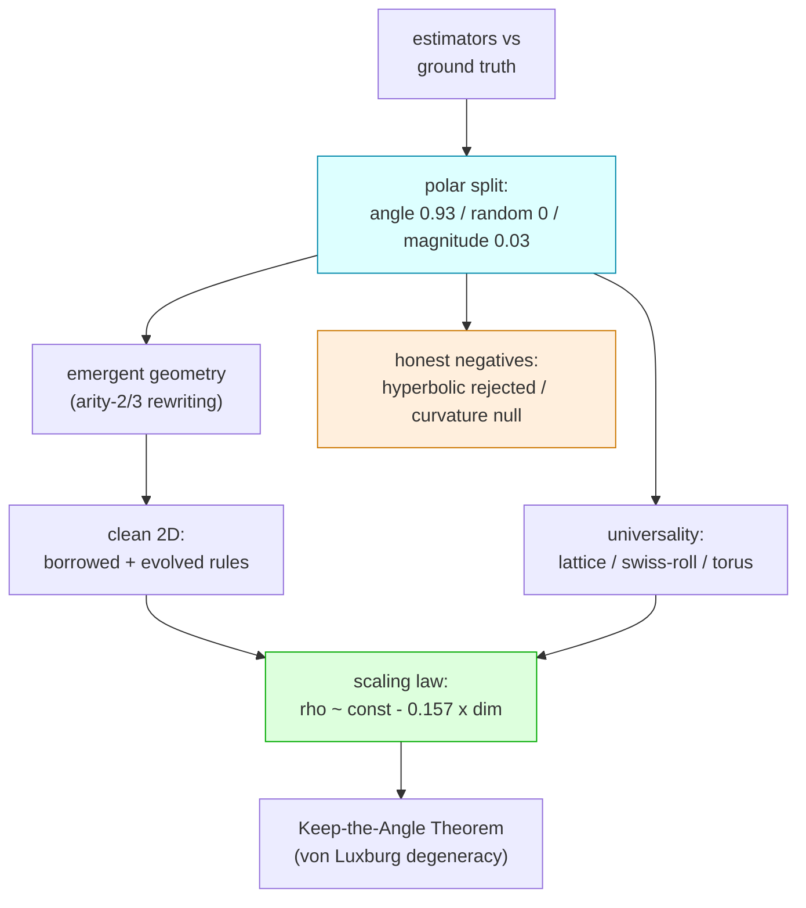

# The Angular Observer

[](https://github.com/ahb-sjsu/the-angular-observer/actions/workflows/ci.yml)
[](LICENSE)
[](https://www.python.org)
[](https://github.com/psf/black)
[](https://github.com/astral-sh/ruff)

**Keep the Angle: a geometry-preserving basis in spectral embeddings.**

> *Keep the angle, drop the magnitude — when the magnitude is nuisance for the
> metric being preserved.* Given the graph normalized-Laplacian
> eigen-embedding, the **angular** coordinates of the low-eigenvalue subspace
> carry the graph's geodesic structure; the **radial** coordinate is
> asymptotically degree/density. Row-normalizing to the unit sphere — the
> Ng–Jordan–Weiss move — is, on manifold-like graphs, the coarse-graining a
> bounded observer performs to perceive a smooth space.

The commute-time Laplacian embedding degenerates on large graphs (von Luxburg):
its distances collapse to local degree. This repository shows the geometry does
not vanish — it is retained by the **angular** coordinate (under strongly
non-uniform sampling, after the Coifman–Lafon α=1 density normalization).
Keeping only the angle (the Ng–Jordan–Weiss row-normalization) preserves graph
geodesics across every substrate family we tested with genuine low-dimensional
Riemannian geometry, while the radial coordinate is provably degenerate. The
underlying *scale-from-direction* decomposition recurs in vector and KV-cache
compression — with a scope boundary the companion practice work makes sharp:
for attention **keys**, per-vector angular quantization fails (attention
depends on per-channel scale in QKᵀ), so the general principle is *keep the
part that carries the task geometry*, not *always keep the angle*
([turboquant-pro](https://github.com/ahb-sjsu/turboquant-pro)). The observer
interpretation of Wolfram's emergent-geometry program is developed as
motivation and bounded honestly.

## Papers

The write-up is split into a theory paper and an empirical companion:

- **Paper I — *Keep the Angle*** (theory): the canonical monolithic source is
  [`paper/paper.tex`](paper/paper.tex) (generic `article`, all proofs inline as
  appendices); the SIAM *Journal on Mathematics of Data Science* submission is the
  derived split build in [`paper/simods/`](paper/simods/) — `main.tex` (≤20-page
  main text) + `supplement.tex`. It contains the normalization identity, the
  deterministic transfer theorem, the conditional graph-to-manifold result, the
  unconditional torus/sphere instances, the **uniform lower angular bound on flat
  tori**, the **exact upper-Lipschitz divergence**, the **spectral-filter phase
  diagram** (critical dimension d = 4), the **Green-kernel rank-limit theorem** for
  d ≤ 3 (rank = 1 on two-point homogeneous spaces), the filter dichotomy, and the
  torus core/verify/ablation experiments.
- **Paper I.b — *Keep the Angle, in Practice*** (empirical): the substrate-agnostic
  manifold diagnostic and its failure modes, in [`paper1b/`](paper1b/) — the
  cross-substrate benchmark, bake-off, hypergraph-rewriting emergent geometry, the
  dimension trend, temporal stability, the two-factor screen, continuum
  dissociation, honest negatives, and the physical interpretation.

Reviewer-response experiments and reproducibility artifacts are in
[`experiments/reviewer-response/`](experiments/reviewer-response/); every headline
number is backed by a committed `*_result.json` and multi-draw where it matters
(ablation, κ, core table, and the (A2) margin on the non-homogeneous swiss-roll).

## The core decomposition



Independent literatures perform the *same decomposition* — separate scale from
direction — and then keep whichever part carries their task geometry:



For graph geodesics that is the angle alone (this repo). For embedding
retrieval it is direction **plus stored norm**; for attention **keys** it is
per-channel scale, and per-vector angular quantization is a counterexample —
the boundary is condition (A2) of the paper's transfer theorem, stated for the
downstream metric.

## The result in one table

Angle-only low-mode Laplacian coarse-graining preserves graph geodesics
(Spearman ρ vs true geodesic distance; random-mode control ≈ 0 throughout):

| substrate | emergent dim | angle-ρ | random (control) |
|---|---|---|---|
| 2-torus (reference) | 2 | 0.93 | ~0.01 |
| king-lattice | 2 | 0.82 | 0.01 |
| swiss-roll embedding trajectory | 2 | 0.93 | 0.01 |
| **emergent Wolfram-model manifold (R_3D)** | **2.07 ± 0.01** | **0.82 ± 0.01** | 0.01 |
| causal set (Lorentzian) | 3.9 ✗ | ties MDS | 0.01 |
| small-world (geometry destroyed) | 3.0 ✗ | 0.45 | 0.00 |

The control fails everywhere required; the metric degrades exactly where geometry
is Lorentzian or destroyed. It is a *geometry detector*, not a magic wand.

## The five findings



1. **Universal, not Wolfram-specific** (`crosssubstrate.py`). The effect holds on
   lattices, manifold-embedding trajectories, and tori — substrates with no
   hypergraph content — and fails correctly on Lorentzian / small-world graphs.
2. **Holds to genuine 2D**, via two independent routes: borrowing a
   literature rule (`gorard_rules.py`) and evolving one from scratch
   (`ga2d.py`). Clean 2D rules are *rare, not absent* — the evolutionary search
   reaches one in ~3 generations.
3. **The Keep-the-Angle Theorem** (`theorem.md`, `theorem_verify.py`). The radius
   is *provably* geometry-free via the von Luxburg–Radl–Hein resistance
   degeneracy (effective resistance → 1/dᵢ + 1/dⱼ for d ≥ 2, so radius → 1/√dᵢ =
   degree noise; ρ(radius, degree) = 0.92–0.99). The angle deletes exactly that.
   Dimension-gated: clean at 3D, marginal at 2D, correctly absent at 1D.
4. **A scaling law** (`library.py`). Across 20 independent emergent manifolds
   (d ≈ 1–3.6), observer fidelity falls linearly with emergent dimension:
   **angle-ρ ≈ const − 0.157·d, Spearman −0.881.**
5. **The honest boundary** (`curvature.py`). Emergent curvature is **not**
   dynamical beyond graph structure. A spectacular raw −0.98 curvature/activity
   correlation deflates to a hub tautology (partial correlation −0.14). This is
   observer theory, **not** the Einstein-tensor claim.

## What is proven vs conjectured (synced to Paper I)

> **Update.** The rank form is no longer only conjectural: the **Green-kernel
> rank-limit theorem** proves that for intrinsic dimension d ≤ 3 the commute
> angular *ranking* converges uniformly in the mode count to a fixed Green-kernel
> ranking — exactly rank 1 on the circle and on compact two-point homogeneous
> spaces (S², S³, ℝP², ℝP³). Angular Preservation thereby reduces to positivity of
> a geometric *Green-rank coefficient*, with the exact obstruction at the critical
> dimension d = 4 (the spectral-filter phase diagram). What stays conjectural is
> two-sided *metric* uniformity (its upper half is provably false for the commute
> filter) and Green-rank positivity on general manifolds.


- **Proven / theorem-backed:** the radial coordinate's degeneracy for d ≥ 3
  (von Luxburg et al. 2010/2014; full diagonal transfer in paper Appendix A —
  d = 2 is the recurrent borderline, treated empirically); a deterministic
  angular-transfer theorem plus a conditional local bi-Lipschitz theorem for
  the commute-weighted eigenmap, **unconditional on the flat torus** (paper
  Thm 6/8, Cor 10); uniform-in-truncation angular bi-Lipschitzness for
  **heat-filtered** eigenmaps (Thm 12); and the plain-eigenmap rank collapse
  (Prop 14).
- **Refuted (self-correction in v0.8):** the old strong form — "the angular
  coordinate stays bi-Lipschitz to geodesic distance uniformly in mode-count"
  at fixed scale — is **false** for the commute weighting: high modes raise
  the local angular speed like √Λ (paper Prop 13; exact on S¹). The correct
  uniform metric object is scale-dependent (above the spectral wavelength
  Λ^(−1/2)), which remains open.
- **Empirically strong conjecture (the surviving form):** the angular
  coordinate stays **rank-faithful** to geodesic distance uniformly in
  mode-count and N — flatness in m is rank stability under a fixed observer
  budget, not an m-independent metric claim. Reduced at fixed m to explicit
  chart hypotheses (H1)–(H3) plus a distance-ratio condition (paper §3.1).
  Stated explicitly in `theorem.md`.
- **Negative results kept, not hidden:** the hyperbolic-reframe hypothesis was
  tested with controls and **rejected** (`hyperbolic.py`); the dynamical-curvature
  test is a clean null (`curvature.py`).

## Layout

- Validation ladder: `rung0_validate.py` → `rung1_proxy.py` → `rung1b_rewriter.py`
  → `rung1c_polar.py` (the PolarQuant angle/magnitude split) → `search_harness.py`.
- Emergent-geometry substrate: `arity3.py` (triangle hyperedge rewriter),
  `gorard_rules.py`, `gorard_confirm.py`, `ga2d.py`.
- Theory: `theorem.md`, `theorem_verify.py`.
- Universality & curvature: `crosssubstrate.py`, `curvature.py`, `hyperbolic.py`.
- Composite: `library.py`.
- Sweep (reproducible): `sweep.py`, `sweep_pod.py`, `sweep3.py`, `nrp_job.yaml`,
  `aggregate.py`. Note: the cluster **driver** scripts (which carry infrastructure
  credentials) are intentionally omitted — supply your own kubeconfig / SSH.

## Reproduce

```bash
python -m pip install numpy scipy         # only dependencies
python rung0_validate.py                  # estimators vs ground truth
python rung1c_polar.py                    # the angle-vs-magnitude result
python theorem_verify.py                  # angle-flat vs full-decays-with-N
python library.py                         # the scaling law
```

## Citation

Andrew H. Bond (SJSU), 2026. ORCID [0009-0003-2599-6158](https://orcid.org/0009-0003-2599-6158).
