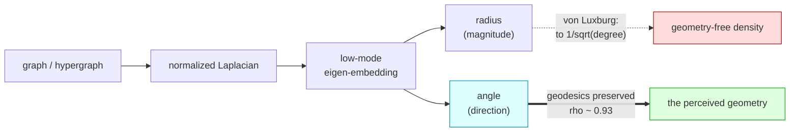
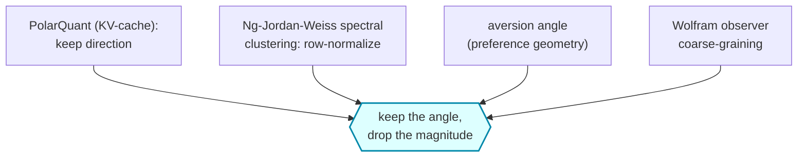
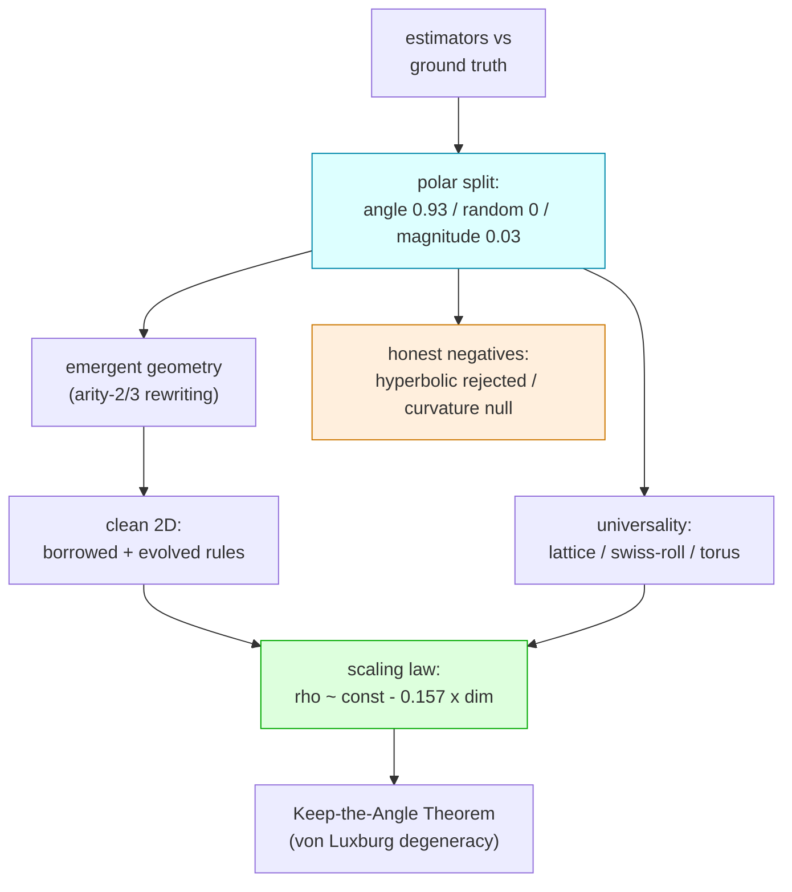

# The Angular Observer

[](https://github.com/ahb-sjsu/the-angular-observer/actions/workflows/ci.yml)
[](LICENSE)
[](https://www.python.org)
[](https://github.com/psf/black)
[](https://github.com/astral-sh/ruff)

**Keep the Angle: a universal geometry-preserving basis in spectral embeddings.**

> *Keep the angle, drop the magnitude.* Given the graph normalized-Laplacian
> eigen-embedding, the **angular** coordinates of the low-eigenvalue subspace
> carry the geometry; the **radial** coordinate is asymptotically geometry-free.
> Row-normalizing to the unit sphere — the Ng–Jordan–Weiss / PolarQuant move — is
> the coarse-graining a bounded observer performs to perceive a smooth space.

The commute-time Laplacian embedding degenerates on large graphs (von Luxburg):
its distances collapse to local degree. This repository shows the geometry does
not vanish — it survives entirely in the **angular** coordinate. Keeping only the
angle (the Ng–Jordan–Weiss row-normalization) preserves graph geodesics
*universally* across substrates with genuine low-dimensional Riemannian geometry,
while the radial coordinate is provably degenerate. The same "keep the direction"
operation recurs in KV-cache compression and — as a motivating interpretation,
developed and bounded honestly — in the coarse-graining of a bounded observer in
Wolfram's emergent-geometry program.

## The core decomposition



Four independent literatures perform the *same* move — keep the scale-invariant
direction, discard the magnitude — which is why the result feels inevitable once
you see it:



## The result in one table

Angle-only low-mode Laplacian coarse-graining preserves graph geodesics
(Spearman ρ vs true geodesic distance; random-mode control ≈ 0 throughout):

| substrate | emergent dim | angle-ρ | random (control) |
|---|---|---|---|
| 2-torus (reference) | 2 | 0.93 | ~0.01 |
| king-lattice | 2 | 0.82 | 0.01 |
| swiss-roll embedding trajectory | 2 | 0.93 | 0.01 |
| **emergent Wolfram-model manifold (R_3D)** | **2.07 ± 0.01** | **0.82 ± 0.01** | 0.01 |
| causal set (Lorentzian) | 3.9 ✗ | ties MDS | 0.01 |
| small-world (geometry destroyed) | 3.0 ✗ | 0.45 | 0.00 |

The control fails everywhere required; the metric degrades exactly where geometry
is Lorentzian or destroyed. It is a *geometry detector*, not a magic wand.

## The five findings



1. **Universal, not Wolfram-specific** (`crosssubstrate.py`). The effect holds on
   lattices, manifold-embedding trajectories, and tori — substrates with no
   hypergraph content — and fails correctly on Lorentzian / small-world graphs.
2. **Holds to genuine 2D**, via two independent routes: borrowing a
   literature rule (`gorard_rules.py`) and evolving one from scratch
   (`ga2d.py`). Clean 2D rules are *rare, not absent* — the evolutionary search
   reaches one in ~3 generations.
3. **The Keep-the-Angle Theorem** (`theorem.md`, `theorem_verify.py`). The radius
   is *provably* geometry-free via the von Luxburg–Radl–Hein resistance
   degeneracy (effective resistance → 1/dᵢ + 1/dⱼ for d ≥ 2, so radius → 1/√dᵢ =
   degree noise; ρ(radius, degree) = 0.92–0.99). The angle deletes exactly that.
   Dimension-gated: clean at 3D, marginal at 2D, correctly absent at 1D.
4. **A scaling law** (`library.py`). Across 20 independent emergent manifolds
   (d ≈ 1–3.6), observer fidelity falls linearly with emergent dimension:
   **angle-ρ ≈ const − 0.157·d, Spearman −0.881.**
5. **The honest boundary** (`curvature.py`). Emergent curvature is **not**
   dynamical beyond graph structure. A spectacular raw −0.98 curvature/activity
   correlation deflates to a hub tautology (partial correlation −0.14). This is
   observer theory, **not** the Einstein-tensor claim.

## What is proven vs conjectured

- **Proven / theorem-backed:** the radial coordinate's degeneracy (von Luxburg
  et al., 2010/2014), and that it equals a local-degree quantity.
- **Empirically strong conjecture:** the angular coordinate stays bi-Lipschitz to
  geodesic distance uniformly in mode-count and N. Von Luxburg explains why the
  *radius dies* (d ≥ 2); it does not by itself explain why the *angle lives* —
  that rests on eigenmap-embedding results plus a heuristic. Stated explicitly in
  `theorem.md`.
- **Negative results kept, not hidden:** the hyperbolic-reframe hypothesis was
  tested with controls and **rejected** (`hyperbolic.py`); the dynamical-curvature
  test is a clean null (`curvature.py`).

## Layout

- Validation ladder: `rung0_validate.py` → `rung1_proxy.py` → `rung1b_rewriter.py`
  → `rung1c_polar.py` (the PolarQuant angle/magnitude split) → `search_harness.py`.
- Emergent-geometry substrate: `arity3.py` (triangle hyperedge rewriter),
  `gorard_rules.py`, `gorard_confirm.py`, `ga2d.py`.
- Theory: `theorem.md`, `theorem_verify.py`.
- Universality & curvature: `crosssubstrate.py`, `curvature.py`, `hyperbolic.py`.
- Composite: `library.py`.
- Sweep (reproducible): `sweep.py`, `sweep_pod.py`, `sweep3.py`, `nrp_job.yaml`,
  `aggregate.py`. Note: the cluster **driver** scripts (which carry infrastructure
  credentials) are intentionally omitted — supply your own kubeconfig / SSH.

## Reproduce

```bash
python -m pip install numpy scipy         # only dependencies
python rung0_validate.py                  # estimators vs ground truth
python rung1c_polar.py                    # the angle-vs-magnitude result
python theorem_verify.py                  # angle-flat vs full-decays-with-N
python library.py                         # the scaling law
```

## Citation

Andrew H. Bond (SJSU), 2026. ORCID [0009-0003-2599-6158](https://orcid.org/0009-0003-2599-6158).
