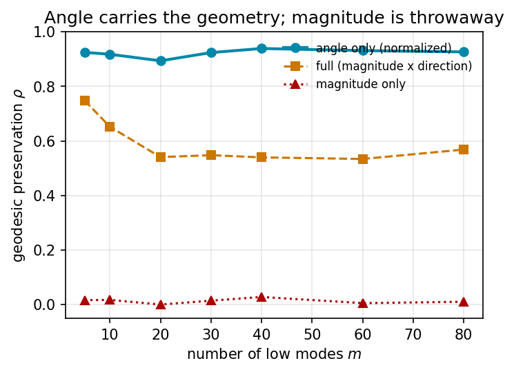
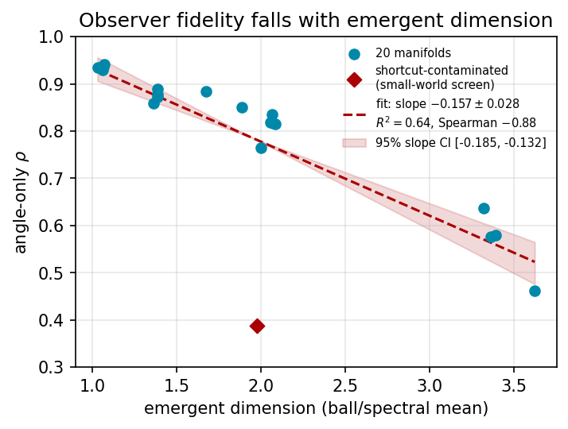

# Keep the Angle: A Universal Geometry-Preserving Basis in Spectral Embeddings

**Andrew H. Bond** · San José State University · ORCID 0009-0003-2599-6158

> **The canonical paper is [`paper.tex`](paper.tex) → [`paper.pdf`](paper.pdf)**
> (working draft v0.4). This page is a short landing summary; the full text,
> theorem/conjecture, methods, and references live in the LaTeX source. Figures
> regenerate from [`figures.py`](figures.py); all numbers from `pip install numpy
> scipy`.

## Abstract

The commute-time (resistance) embedding built from the low eigenvectors of a
graph Laplacian is a workhorse of spectral geometry, yet its distances are known
to *degenerate* on large graphs (von Luxburg–Radl–Hein). We show the geometry does
not vanish — it migrates entirely into the **angular** coordinate. Writing each
node's low-mode embedding in polar form (magnitude × direction), the direction
preserves graph geodesics at Spearman ρ ≈ 0.89 on a reference manifold, while the
magnitude preserves ρ ≈ 0.03 and a random-mode basis of equal size preserves
ρ ≈ 0.04. Keeping only the angle is exactly the row-normalization of
Ng–Jordan–Weiss spectral clustering, whose existing theory concerns *cluster
separation* (Schiebinger–Wainwright–Yu); we give it a **geodesic** justification.
We **prove** (corollary of von Luxburg–Radl–Hein) that the radial coordinate of
the full embedding degenerates to a local-degree quantity for intrinsic dimension
d ≥ 2, and **conjecture**, with strong empirical support, that the angular
coordinate remains rank-faithful to geodesic distance — flat in both mode-count
and graph size where the raw embedding decays. The basis is **universal** across
substrates with genuine low-dimensional Riemannian geometry (lattices,
manifold-embedding trajectories, Wolfram-model hypergraph rewriting) and fails
correctly on Lorentzian causal sets and geometry-destroying small-world graphs.
Across 20 independent emergent manifolds (d ≈ 1–3.6), fidelity falls approximately
linearly with intrinsic dimension (slope −0.157 ± 0.028, R² = 0.64).

## The core result

On a 2-torus, the polar split of the low-mode embedding (95% bootstrap CIs over
11,175 anchor pairs; angle 0.894 [0.888, 0.899], magnitude 0.006, random 0.037):

## Structure of the argument (see `paper.tex` for full statements)

- **Theorem 1 (Radial Degeneracy, proven)** — for the *full* unnormalized commute
  embedding, the radius → 1/√degree, geometry-free (von Luxburg–Radl–Hein).
- **Remark (truncated/normalized radius)** — the radius actually used is truncated
  and normalized; the degeneracy is an empirical observation there, not proven.
- **Conjecture 1 (Angular Preservation)** — the angle stays *rank-faithful* to
  geodesics uniformly in modes and size (bi-Lipschitz is a stated stronger form,
  untested).
- **Universality**, a **scaling law**, and two **honest negatives** (hyperbolic
  reframe rejected; curvature not dynamical) — all in the paper.
