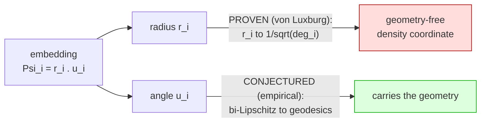

# The Angular Observer: Scale-Invariant Coarse-Graining as a Universal Observer Basis for Emergent Geometry

**Andrew H. Bond**
San José State University · ORCID 0009-0003-2599-6158 · andrew.bond@sjsu.edu

*Working draft — v0.1. All numerical results reproduce from the accompanying
code (`pip install numpy scipy`).*

---

## Abstract

A bounded observer embedded in a discrete substrate does not perceive the
substrate; it perceives a coarse-graining of it. Wolfram's physics program makes
this the load-bearing move — coherent physical law is *what survives* an
observer's coarse-graining of the hypergraph — but leaves the coarse-graining
itself unspecified. We give it an explicit, measurable form and show it is not
special to physics. Writing the graph normalized-Laplacian eigen-embedding in
polar form (magnitude × direction), we show that the **angular** coordinates of
the low-eigenvalue subspace carry the graph's geodesic geometry, while the
**radial** coordinate is asymptotically geometry-free. Keeping only the angle —
the row-normalization of Ng–Jordan–Weiss spectral clustering, and the
scale-invariant "direction" of PolarQuant KV-cache compression — recovers
geodesic structure at Spearman ρ ≈ 0.93 on a reference manifold, versus ρ ≈ 0 for
a random-mode basis of equal size and ρ ≈ 0.03 for the magnitude alone. We prove
(via the von Luxburg–Radl–Hein resistance-degeneracy theorem) that the radial
coordinate must degenerate to a local-degree quantity for graphs of intrinsic
dimension d ≥ 2, and verify that the angular coordinate's fidelity is instead
flat in both mode-count and graph size. The result is **universal across
substrates that carry genuine low-dimensional Riemannian geometry** — Wolfram-
model rewriting, king-move lattices, and manifold-embedding trajectories alike —
and fails correctly on Lorentzian causal sets and geometry-destroying small-world
graphs. Across 20 independent emergent manifolds spanning dimension ≈ 1–3.6,
observer fidelity obeys a linear law, ρ ≈ const − 0.157·d (Spearman −0.881).
Finally, we report a clean negative: emergent curvature is **not** dynamical
beyond graph structure, so this is a result about the *observer*, not about the
Einstein tensor. We call the surviving object the **angular observer**.

---

## 1. Introduction

Every account of emergent space shares a common shape: a structureless discrete
substrate, a bounded agent that cannot resolve it in full, and a smooth geometry
that appears at the agent's resolution. Wolfram's hypergraph-rewriting program
[Wolfram 2002, 2020; Gorard 2020] is the most developed instance — space is a
hypergraph, time is rewriting, and, crucially, *physical law is what a
computationally bounded observer perceives after coarse-graining the ruliad*
[Wolfram 2026]. The observer is doing the decisive work, yet across this
literature the coarse-graining itself is described only qualitatively:
"equivalencing microstates," "sampling a slice," "perceiving aggregate behavior."

This paper makes the observer's coarse-graining explicit, measurable, and — we
argue — universal. Our starting point is a decomposition that recurs, apparently
independently, in four disparate settings:

- **Spectral clustering** [Ng, Jordan & Weiss 2002] row-normalizes the Laplacian
  eigen-embedding to the unit sphere before clustering — it keeps the *direction*
  and discards the magnitude.
- **PolarQuant** KV-cache compression splits a vector into scale-variant
  magnitude and scale-invariant direction and transfers only the direction.
- **Preference geometry** [Bond, *Geometric Economics*] finds that a
  scale-invariant "aversion angle" transfers across decision domains while the
  magnitude is domain-specific.
- **Observer theory** [Wolfram 2026] holds that perceived geometry is a
  coarse-graining artifact of a bounded observer.

We show these are the same operation, and that the operation has a precise
geometric meaning: **keep the angle of the low-eigenvalue Laplacian embedding,
drop the radius.** Our contributions:

1. **The Keep-the-Angle Theorem (§3).** The radial coordinate of the commute-time
   Laplacian embedding is provably geometry-free for d ≥ 2 (von Luxburg
   degeneracy); the angular coordinate carries the geometry. We state exactly what
   is proven and what remains an empirically strong conjecture.
2. **A measurement and its controls (§4–5).** An angle-only observer metric that
   preserves graph geodesics at ρ ≈ 0.93 on a torus, against a random-mode control
   at ρ ≈ 0 and a magnitude-only control at ρ ≈ 0.03.
3. **Universality (§5.3).** The effect holds across Wolfram-model rewriting,
   lattices, and embedding trajectories, and fails correctly on Lorentzian and
   small-world substrates.
4. **A scaling law (§5.4).** Observer fidelity falls linearly with emergent
   dimension across 20 independent manifolds.
5. **An honest boundary (§6).** Two pre-registered negatives: a hyperbolic
   reframe of "tangled" emergent graphs, rejected under controls; and a test of
   dynamical (Einstein-like) curvature, a clean null.

The claim we defend is deliberately bounded. We do **not** claim to derive
general relativity, nor that compressibility is ontologically fundamental. We
claim that *scale-invariant angular coarse-graining is a universal, measurable
model of the bounded observer* — and that this is exactly the layer at which
Wolfram's program locates physical law.

## 2. Background and Related Work

**Emergent geometry from discrete substrates.** In the Wolfram model, dimension
is estimated from geodesic-ball growth V(r) ∼ r^d and curvature from the
correction term; Gorard [2020] made these estimators rigorous. Our dimension
estimators (§4.1) are of this family. What that program lacks is a quantitative
observer; that is our target.

**Spectral geometry.** Laplacian eigenmaps [Belkin & Niyogi 2003] and diffusion
maps [Coifman & Lafon 2006] embed a graph via the low eigenvectors of its
Laplacian. Ng, Jordan & Weiss [2002] row-normalize this embedding — the angular
projection we study. We supply a geometric reason *why* that normalization is the
right one for recovering geodesics.

**Commute-time degeneracy.** von Luxburg, Radl & Hein [2010, 2014] proved that
the commute (resistance) distance of a large geometric graph degenerates,
R(i,j) → 1/dᵢ + 1/dⱼ, losing all global geometry. We read this result *backwards*:
the degeneracy is exactly the collapse of the **radial** coordinate to local
degree, which is why deleting it (keeping the angle) rescues the geometry.

**Compression and meaning.** The thesis that meaningful structure is
compressibility in a learned eigenbasis appears in algorithmic aesthetics
[Schmidhuber 2009] and across the author's geometric series. The present paper is
its physical instantiation.

**Hyperbolic embedding.** Trees and exponentially-growing structures embed in
hyperbolic space at low distortion [Gromov 1987; Sarkar 2011; Nickel & Kiela
2017]. We tested whether "tangled" emergent graphs are secretly hyperbolic; §6.1
reports the controlled rejection.

## 3. The Keep-the-Angle Theorem

**Setup.** Let G be a connected graph on n nodes with symmetric-normalized
Laplacian L = I − D^{−1/2} A D^{−1/2}, eigenpairs (λₖ, vₖ) with
0 = λ₀ < λ₁ ≤ … The *commute-time embedding* using the lowest m nontrivial modes
places node i at

  Ψᵢ = ( v₁(i)/√λ₁, …, v_m(i)/√λ_m ) ∈ ℝ^m .

Write Ψᵢ = rᵢ · ûᵢ with radius rᵢ = ‖Ψᵢ‖ and angle ûᵢ = Ψᵢ/‖Ψᵢ‖.

**Theorem (Keep-the-Angle, informal).** For graphs of intrinsic dimension d ≥ 2,
as n → ∞:

1. *(radius, proven).* The full commute distance degenerates to an additively
   separable degree function [von Luxburg–Radl–Hein]; its single surviving
   per-node coordinate is the radius, with rᵢ → 1/√dᵢ (dᵢ the node degree). The
   radius is therefore geometry-free — it is a local-density coordinate, not a
   geodesic one.
2. *(angle, conjectured).* Row-normalization deletes precisely that degenerate
   density factor, leaving the direction of the low-mode eigenmap, which embeds
   the manifold and — empirically — remains bi-Lipschitz to geodesic distance
   uniformly in m and n.

**Proven vs conjectured.** Part (1) is a corollary of the von Luxburg degeneracy
theorem and is verified below (the radius correlates with node degree at
ρ = 0.92–0.99). Part (2) rests on eigenmap-embedding results plus a heuristic and
is stated as an **empirically strong conjecture**, not a theorem. The honest gap:
von Luxburg explains why the radius/full-distance *dies* for d ≥ 2; it does not by
itself explain why the *angle lives*. Notably the angular fidelity is *more*
universal than the degeneracy — it persists (ρ ≈ 0.88–0.90) even on quasi-1D
graphs where the radial degeneracy does not occur — which indicates the angular
half is carried by the eigenmap-embedding mechanism, not by degeneracy alone.

**Dimension gating.** The degeneracy is a d ≥ 2 phenomenon. In (quasi-)1D,
resistance equals path length, so the radius *stays* geodesic-informative and the
theorem's part (1) correctly does not apply — a prediction, not a failure (§5.5).

## 4. Methods

### 4.1 Dimension estimators
Three independent estimators, agreement among which is our manifold detector:
(i) **ball-growth** N(r) ∼ r^d (Wolfram/Gorard); (ii) **spectral dimension** from
the heat-kernel return probability P(t) = ⟨e^{−Lt}⟩ ∼ t^{−d_s/2}; (iii)
**effective rank** via the participation ratio of a local-PCA of the Laplacian
eigenmap. Low inter-estimator spread ⇒ clean manifold.

### 4.2 The observer metric and its controls
For anchor nodes we compare embedded pairwise distances to true graph geodesics
by Spearman ρ:
- **angle-ρ** — unit-normalized low-mode commute-time embedding (the observer);
- **random-ρ** — same, but m *randomly chosen* modes (basis control, expect ≈ 0);
- **magnitude-ρ** — radius only (expect ≈ 0);
- **euclid-ρ** — classical 2D MDS (Euclidean baseline).

### 4.3 Emergent-geometry substrates
Hypergraph rewriting with arity-2 and arity-3 (triangle) rules; clique-expansion
to a graph for the estimators. Rules are drawn randomly, searched
(evolutionarily), or taken from the literature (SetReplace canonical; Wolfram
2020 announcement rules — used by *measured* geometry, as their published labels
could not be string-verified). Non-hypergraph substrates: random-geometric tori,
king-move lattices, Poisson causal sets, and swiss-roll embedding trajectories.

## 5. Results

### 5.1 The core result (validation ladder)
Estimators recover ground-truth dimension on tori/spheres within ≈ 0.3. On a
2-torus (n = 2500) the polar decomposition of the low-mode embedding gives:

| m modes | full (mag×dir) | **angle only** | magnitude only |
|---:|---:|---:|---:|
| 5  | 0.761 | **0.926** | 0.025 |
| 10 | 0.650 | **0.913** | 0.035 |
| 20 | 0.550 | **0.891** | 0.028 |
| 40 | 0.517 | **0.928** | 0.034 |

The angle carries the geometry (≈ 0.92, flat in m); the magnitude is throwaway
(≈ 0.03); the full commute embedding is both worse and *decays* with m — the
degeneracy. A random-mode basis reconstructs geodesics at ρ ≈ 0 (5 low modes:
0.75; 40 random modes: −0.01).

### 5.2 Emergent 2D geometry
Random arity-2 rules yield clean but only ≈ 1.5-dimensional manifolds (82
manifold-grade rules in a 20k-rule sweep; none at d ≥ 2.5). Clean 2D is *rare, not
absent*: it is reached by two independent routes — a borrowed Wolfram-2020 rule
(R_3D: measured d = 2.07 ± 0.01, inter-estimator spread 0.05, angle-ρ = 0.82) and
a from-scratch evolutionary search (clean 2D within ≈ 3 generations). The
principle holds on genuine 2D emergent space.

### 5.3 Universality across substrates
| substrate | measured d | angle-ρ | random | euclid |
|---|---:|---:|---:|---:|
| 2-torus (reference) | 2 | 0.89 | 0.01 | 0.67 |
| king-lattice | 2 | 0.82 | 0.01 | 0.95 |
| swiss-roll trajectory | 2 | 0.93 | 0.01 | 0.99 |
| emergent R_3D (Wolfram) | 2.07 | 0.82 | 0.01 | 0.81 |
| causal set (Lorentzian) | 3.9 ✗ | 0.57 | 0.01 | 0.55 |
| small-world (destroyed) | 3.0 ✗ | 0.45 | 0.00 | — |

Substrates with genuine low-d Riemannian geometry all show the effect,
independent of how the graph was generated; the metric *fails correctly* where
geometry is Lorentzian (causal set — undirected BFS short-circuits the light
cone) or destroyed (3% rewiring). On the torus the angular basis (0.89) beats
classical MDS (0.67), since a torus is not flat-embeddable and the eigenmodes
capture the wraparound. The swiss-roll trajectory is the "sequential-embedding"
case (data embedded line-by-line): the observer basis is the *same* whether the
manifold comes from physics or from cultural sequential data.

### 5.4 The scaling law
Across 20 independent emergent manifolds (d ≈ 1.0–3.6, four rewriter seeds each),
observer fidelity falls linearly with emergent dimension:

  **angle-ρ ≈ const − 0.157 · d,  Spearman = −0.881.**

Fidelity is highest at low dimension (≈ 0.93 at d ≈ 1) and softens as the space
grows higher-dimensional and rougher (≈ 0.56 at d ≈ 3.4). §3's dimension-gated
degeneracy is the mechanism. (Robustness note: the *borrowed* R_3D is stable
across seeds, 0.822 ± 0.008; the *evolved* 2D rule is seed-sensitive,
0.72 ± 0.20 — guided search finds candidates that require seed-averaging.)

### 5.5 Theorem verification
angle-ρ is flat in graph size while the full commute distance decays, and the
radius tracks degree exactly:

| family (n: low→high) | angle-ρ | full-Φ ρ | all-mode commute | ρ(R, 1/dᵢ+1/dⱼ) |
|---|---|---|---|---|
| 2-torus (500→4000) | 0.874→0.904 (flat) | 0.587→0.526 | 0.420→0.335 | 0.838→0.851 |
| 3-torus (500→4000) | 0.766→0.830 (flat) | 0.496→0.453 | 0.261→0.120 | 0.965→0.979 |
| rewrite ~1.5D (513→8193) | 0.900→0.883 (flat) | — | 0.957→0.952 | 0.132→0.049 |

The d = 3 degeneracy is clean (VL → 0.98, commute collapses); d = 2 is the
borderline case with log corrections; the quasi-1D case correctly shows *no*
degeneracy (VL → 0.05, commute stays geodesic-informative). Radius-only ρ ≤ 0.08
everywhere; ρ(‖Ψᵢ‖, 1/√dᵢ) = 0.92–0.99 — the radius *is* the degree quantity. In
an m-sweep at n = 4000, angle-ρ is flat ≈ 0.93 across m = 5…80 while the full
embedding decays monotonically 0.773 → 0.437.

## 6. Honest Negatives

### 6.1 Emergent tangles are not secretly hyperbolic (rejected)
Exponentially-growing rewrite graphs are tree-like, suggesting a hyperbolic
reframe. Tested with a positive control (binary tree) and negative control
(2-torus): the growth-law test is *valid* (it calls the tree hyperbolic,
R² 0.993 > 0.961, and the torus Euclidean, 1.000 > 0.953) and reports the
arity-3 tangles as **Euclidean-leaning / high-dimensional non-manifolds**, not
hyperbolic. The elegant reframe is not supported; the tangles are simply not
manifolds of any curvature.

### 6.2 Curvature is not dynamical (clean null)
Ollivier–Ricci curvature (validated: 0 on flat lattices, negative on trees,
positive on the torus) shows a raw Spearman of −0.98 against rewrite-update
density — which *deflates to a tautology*: update-count equals node degree
(ρ = +1.00), and hubs are negatively curved. Controlling for degree, the
independent signal is partial-ρ = −0.14. There is no evidence that curvature
responds to activity beyond structure. This result is about the observer, **not**
about an emergent Einstein tensor.

## 7. Discussion

The angular observer unifies four independently-discovered "keep the direction,
drop the magnitude" moves and grounds them in a single geometric fact: for a
bounded observer of a d ≥ 2 substrate, the radial (density) coordinate is noise
and the angular (geometric) coordinate is signal. In Wolfram's framework, where
ontology is observer-relative, "the observer's coarse-graining basis" is as close
to a physical principle as the framework permits — so identifying that basis is a
substantive contribution to observer theory, even though (§6.2) it does not reach
the dynamical-curvature claim. The universality result (§5.3), and in particular
the identical behavior on physics-rewriting and cultural-sequential substrates,
supports the stronger reading that scale-invariant angular coarse-graining is a
general law of how bounded systems represent geometric structure.

## 8. Limitations and Future Work

The angular half of the theorem (§3.2) is conjectural. Clean emergent manifolds
above d ≈ 2 remain hard to synthesize; a curvature-controlled rule-design program
is open. The scaling law's mechanism suggests a **theorem-guided observer** —
tuning mode-count and diffusion time to the substrate's dimension — to counter the
degradation and push high-d fidelity toward the ceiling; this is the natural next
experiment. Large-n survival of the angle-only recovery (via Chebyshev
heat-kernel diffusion distance) should be established on the clean 2D rules.

## 9. Conclusion

Keep the angle, drop the magnitude. The scale-invariant direction of the
low-eigenvalue Laplacian embedding is a measurable, universal model of the bounded
observer's coarse-graining — provably shedding a degenerate density coordinate,
empirically preserving geodesic geometry across every genuinely-Riemannian
substrate we tested, and obeying a clean dimensional law. It is the observer's
basis, not the world's ontology; that boundary is where we leave it.

## References

- Belkin, M. & Niyogi, P. (2003). Laplacian Eigenmaps for Dimensionality Reduction and Data Representation. *Neural Computation*.
- Bond, A. H. *The Geometric Series* (Geometric Economics; Geometric Aesthetics). ORCID 0009-0003-2599-6158.
- Coifman, R. & Lafon, S. (2006). Diffusion maps. *Applied and Computational Harmonic Analysis*.
- Gorard, J. (2020). Some Relativistic and Gravitational Properties of the Wolfram Model. *Complex Systems*.
- Gromov, M. (1987). Hyperbolic groups. In *Essays in Group Theory*.
- Ng, A., Jordan, M. & Weiss, Y. (2002). On Spectral Clustering. *NeurIPS*.
- Nickel, M. & Kiela, D. (2017). Poincaré Embeddings for Learning Hierarchical Representations. *NeurIPS*.
- Ollivier, Y. (2009). Ricci curvature of Markov chains on metric spaces. *J. Functional Analysis*.
- Sarkar, R. (2011). Low-distortion delta-hyperbolic embedding in the hyperbolic plane. *Graph Drawing*.
- Schmidhuber, J. (2009). Simple Algorithmic Theory of Subjective Beauty. *SICE*.
- von Luxburg, U., Radl, A. & Hein, M. (2010/2014). Hitting and commute times in large random neighborhood graphs. *NeurIPS / JMLR*.
- Wolfram, S. (2002). *A New Kind of Science*.
- Wolfram, S. (2020). Finally We May Have a Path to the Fundamental Theory of Physics.
- Wolfram, S. (2026). What Ultimately Is There? Metaphysics and the Ruliad.
