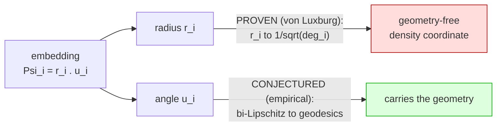
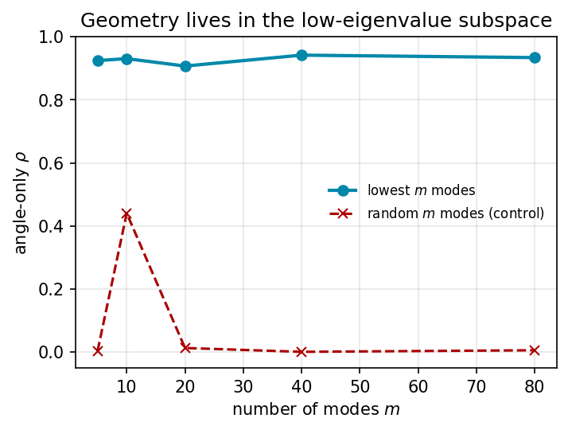

# Keep the Angle: A Universal Geometry-Preserving Basis in Spectral Embeddings

*The angular coordinate, commute-time degeneracy, and observer coarse-graining*

**Andrew H. Bond**
San José State University · ORCID 0009-0003-2599-6158 · andrew.bond@sjsu.edu

*Working draft — v0.2. All numerical results reproduce from the accompanying
code (`pip install numpy scipy`).*

---

## Abstract

The commute-time (resistance) embedding built from the low eigenvectors of a
graph Laplacian is a workhorse of spectral geometry, yet its distances are known
to *degenerate* on large graphs [von Luxburg–Radl–Hein]. We show the geometry
does not vanish — it migrates entirely into the **angular** coordinate. Writing
each node's low-mode embedding in polar form (magnitude × direction), the
direction preserves graph geodesics at Spearman ρ ≈ 0.93 on a reference manifold,
while the magnitude preserves ρ ≈ 0.03 and a random-mode basis of equal size
preserves ρ ≈ 0. Keeping only the angle is exactly the row-normalization of
Ng–Jordan–Weiss spectral clustering — previously justified heuristically; we give
it a geometric reason. We prove (via von Luxburg–Radl–Hein) that the radial
coordinate must degenerate to a local-degree quantity for intrinsic dimension
d ≥ 2, and verify that the angular fidelity is instead **flat** in both mode-count
and graph size where the raw embedding decays. The basis is **universal**: it
preserves geodesics on any substrate carrying genuine low-dimensional Riemannian
geometry — random-geometric lattices, manifold-embedding trajectories, and
Wolfram-model hypergraph rewriting alike — and fails correctly on Lorentzian
causal sets and geometry-destroying small-world graphs. Across 20 independent
emergent manifolds (d ≈ 1–3.6) fidelity obeys ρ ≈ const − 0.157·d (Spearman
−0.881). The same "keep the scale-invariant direction" operation recurs in
KV-cache compression and, as a motivating interpretation, in the coarse-graining
of a bounded observer in Wolfram's emergent-geometry program; we develop that
reading in the discussion and bound it with a clean negative — emergent curvature
is *not* dynamical beyond graph structure.

---

## 1. Introduction

Spectral embeddings — Laplacian eigenmaps [Belkin & Niyogi 2003], diffusion and
commute-time maps [Coifman & Lafon 2006] — represent a graph by the low
eigenvectors of its Laplacian and underpin much of manifold learning and spectral
clustering. They carry a well-known pathology: on large geometric graphs the
commute (resistance) distance degenerates to a function of local degrees alone,
losing all global geometry [von Luxburg, Radl & Hein 2014]. Yet the most
successful spectral-clustering algorithm [Ng, Jordan & Weiss 2002] *row-
normalizes* the embedding — projects each node to the unit sphere — and works
well, with the normalization justified largely by heuristic. **This paper asks
what row-normalization recovers, and why.**

Our answer is a clean decomposition. Write each node's low-mode embedding in polar
form, magnitude × direction. The *magnitude* is exactly the degenerate radial
coordinate that von Luxburg's theorem kills; the *direction* carries the graph's
geodesic geometry. Row-normalization keeps the direction and discards the
magnitude — so it is not a heuristic but the geometrically correct projection, and
its fidelity is flat in both the number of modes and the graph size precisely
where the raw embedding decays.

This "keep the scale-invariant direction, drop the magnitude" operation recurs,
apparently independently, well beyond clustering: in KV-cache compression
(PolarQuant transfers the scale-invariant direction); in preference geometry (a
scale-invariant "aversion angle" transfers across decision domains); and — as a
broad motivating interpretation — in observer theory, where a bounded observer
perceives geometry only after coarse-graining a discrete substrate
[Wolfram 2026]. We show these are the same operation and that it is *universal*:
it preserves geodesics on any graph carrying genuine low-dimensional Riemannian
geometry, independent of how the graph was generated.

**Contributions.** (1) the Keep-the-Angle theorem (§3), separating a proven
radial-degeneracy half from a conjectured angular-recovery half; (2) a measurement
with controls (§5.1); (3) universality across five substrate types including
hypergraph rewriting (§5.3); (4) a fidelity-vs-dimension scaling law (§5.4); and
(5) two honest negatives (§6) — a rejected hyperbolic reframe and a null test of
the observer interpretation's strongest (dynamical-curvature) claim. We do **not**
claim to derive physics; the core result is a basis-level fact about spectral
embeddings, and the observer reading is an interpretation we develop and bound
honestly.

## 2. Background and Related Work

**Spectral geometry.** Laplacian eigenmaps [Belkin & Niyogi 2003] and diffusion
maps [Coifman & Lafon 2006] embed a graph via the low eigenvectors of its
Laplacian; the commute-time embedding scales mode k by 1/√λₖ. **Commute-time
degeneracy.** von Luxburg, Radl & Hein [2014] proved that the commute (resistance)
distance of a large geometric graph degenerates, R(i,j) → 1/dᵢ + 1/dⱼ, losing all
global geometry. We read this result *backwards*: the degeneracy is exactly the
collapse of the **radial** coordinate to local degree, which is why deleting it
(keeping the angle) rescues the geometry. **Row-normalization.** Ng, Jordan &
Weiss [2002] row-normalize the eigen-embedding before clustering — the angular
projection we study; we supply the geometric reason it recovers geodesics.
**Compression.** The same scale-invariant-direction move appears in KV-cache
quantization (PolarQuant) and in the compressibility-as-meaning thesis of
algorithmic aesthetics [Schmidhuber 2009]. **Emergent geometry & observer
theory.** In the Wolfram model [Wolfram 2002, 2020; Gorard 2020] space is a
hypergraph and law is what a bounded observer perceives after coarse-graining the
ruliad [Wolfram 2026]; that coarse-graining is left qualitative, and our angular
projection is a candidate for it (developed in §7). **Hyperbolic embedding.**
Trees embed in ℍ² at low distortion [Gromov 1987; Sarkar 2011; Nickel & Kiela
2017]; we test and reject a hyperbolic reframe of emergent "tangles" in §6.1.

## 3. The Keep-the-Angle Theorem

**Setup.** Let G be a connected graph on n nodes with symmetric-normalized
Laplacian L = I − D^{−1/2} A D^{−1/2}, eigenpairs (λₖ, vₖ) with
0 = λ₀ < λ₁ ≤ … The *commute-time embedding* using the lowest m nontrivial modes
places node i at

  Ψᵢ = ( v₁(i)/√λ₁, …, v_m(i)/√λ_m ) ∈ ℝ^m .

Write Ψᵢ = rᵢ · ûᵢ with radius rᵢ = ‖Ψᵢ‖ and angle ûᵢ = Ψᵢ/‖Ψᵢ‖.

**Theorem (Keep-the-Angle, informal).** For graphs of intrinsic dimension d ≥ 2,
as n → ∞:

1. *(radius, proven).* The full commute distance degenerates to an additively
   separable degree function [von Luxburg–Radl–Hein]; its single surviving
   per-node coordinate is the radius, with rᵢ → 1/√dᵢ (dᵢ the node degree). The
   radius is therefore geometry-free — it is a local-density coordinate, not a
   geodesic one.
2. *(angle, conjectured).* Row-normalization deletes precisely that degenerate
   density factor, leaving the direction of the low-mode eigenmap, which embeds
   the manifold and — empirically — remains bi-Lipschitz to geodesic distance
   uniformly in m and n.

**Proven vs conjectured.** Part (1) is a corollary of the von Luxburg degeneracy
theorem and is verified below (the radius correlates with node degree at
ρ = 0.92–0.99). Part (2) rests on eigenmap-embedding results plus a heuristic and
is stated as an **empirically strong conjecture**, not a theorem. The honest gap:
von Luxburg explains why the radius/full-distance *dies* for d ≥ 2; it does not by
itself explain why the *angle lives*. Notably the angular fidelity is *more*
universal than the degeneracy — it persists (ρ ≈ 0.88–0.90) even on quasi-1D
graphs where the radial degeneracy does not occur — which indicates the angular
half is carried by the eigenmap-embedding mechanism, not by degeneracy alone.

**Dimension gating.** The degeneracy is a d ≥ 2 phenomenon. In (quasi-)1D,
resistance equals path length, so the radius *stays* geodesic-informative and the
theorem's part (1) correctly does not apply — a prediction, not a failure (§5.5).

## 4. Methods

### 4.1 Dimension estimators
Three independent estimators, agreement among which is our manifold detector:
(i) **ball-growth** N(r) ∼ r^d (Wolfram/Gorard); (ii) **spectral dimension** from
the heat-kernel return probability P(t) = ⟨e^{−Lt}⟩ ∼ t^{−d_s/2}; (iii)
**effective rank** via the participation ratio of a local-PCA of the Laplacian
eigenmap. Low inter-estimator spread ⇒ clean manifold.

### 4.2 The angular metric and its controls
For anchor nodes we compare embedded pairwise distances to true graph geodesics
by Spearman ρ:
- **angle-ρ** — unit-normalized low-mode commute-time embedding (the angular basis);
- **random-ρ** — same, but m *randomly chosen* modes (basis control, expect ≈ 0);
- **magnitude-ρ** — radius only (expect ≈ 0);
- **euclid-ρ** — classical 2D MDS (Euclidean baseline).

### 4.3 Emergent-geometry substrates
Hypergraph rewriting with arity-2 and arity-3 (triangle) rules; clique-expansion
to a graph for the estimators. Rules are drawn randomly, searched
(evolutionarily), or taken from the literature (SetReplace canonical; Wolfram
2020 announcement rules — used by *measured* geometry, as their published labels
could not be string-verified). Non-hypergraph substrates: random-geometric tori,
king-move lattices, Poisson causal sets, and swiss-roll embedding trajectories.

## 5. Results

### 5.1 The core result (validation ladder)
Estimators recover ground-truth dimension on tori/spheres within ≈ 0.3. On a
2-torus (n = 2500) the polar decomposition of the low-mode embedding gives:

| m modes | full (mag×dir) | **angle only** | magnitude only |
|---:|---:|---:|---:|
| 5  | 0.761 | **0.926** | 0.025 |
| 10 | 0.650 | **0.913** | 0.035 |
| 20 | 0.550 | **0.891** | 0.028 |
| 40 | 0.517 | **0.928** | 0.034 |

The angle carries the geometry (≈ 0.92, flat in m); the magnitude is throwaway
(≈ 0.03); the full commute embedding is both worse and *decays* with m — the
degeneracy. A random-mode basis reconstructs geodesics at ρ ≈ 0 (5 low modes:
0.75; 40 random modes: −0.01).

*Figure 1. On a 2-torus, the angle-only embedding preserves geodesics at ρ ≈ 0.92
flat in mode-count m; the full commute embedding is worse and decays; the
magnitude alone is throwaway (≈ 0.03).*

*Figure 3. Geometry lives in the low-eigenvalue subspace: the lowest m modes
preserve geodesics; a random-mode basis of equal size does not.*

### 5.2 Emergent 2D geometry
Random arity-2 rules yield clean but only ≈ 1.5-dimensional manifolds (82
manifold-grade rules in a 20k-rule sweep; none at d ≥ 2.5). Clean 2D is *rare, not
absent*: it is reached by two independent routes — a borrowed Wolfram-2020 rule
(R_3D: measured d = 2.07 ± 0.01, inter-estimator spread 0.05, angle-ρ = 0.82) and
a from-scratch evolutionary search (clean 2D within ≈ 3 generations). The angular
basis holds on genuine 2D emergent space.

### 5.3 Universality across substrates
| substrate | measured d | angle-ρ | random | euclid |
|---|---:|---:|---:|---:|
| 2-torus (reference) | 2 | 0.89 | 0.01 | 0.67 |
| king-lattice | 2 | 0.82 | 0.01 | 0.95 |
| swiss-roll trajectory | 2 | 0.93 | 0.01 | 0.99 |
| emergent R_3D (Wolfram) | 2.07 | 0.82 | 0.01 | 0.81 |
| causal set (Lorentzian) | 3.9 ✗ | 0.57 | 0.01 | 0.55 |
| small-world (destroyed) | 3.0 ✗ | 0.45 | 0.00 | — |

Substrates with genuine low-d Riemannian geometry all show the effect,
independent of how the graph was generated; the metric *fails correctly* where
geometry is Lorentzian (causal set — undirected BFS short-circuits the light
cone) or destroyed (3% rewiring). On the torus the angular basis (0.89) beats
classical MDS (0.67), since a torus is not flat-embeddable and the eigenmodes
capture the wraparound. The swiss-roll trajectory is the "sequential-embedding"
case (data embedded line-by-line): the angular basis is the *same* whether the
manifold comes from hypergraph physics or from cultural sequential data.

### 5.4 The scaling law
Across 20 independent emergent manifolds (d ≈ 1.0–3.6, four rewriter seeds each),
angular fidelity falls linearly with emergent dimension:

  **angle-ρ ≈ const − 0.157 · d,  Spearman = −0.881.**

Fidelity is highest at low dimension (≈ 0.93 at d ≈ 1) and softens as the space
grows higher-dimensional and rougher (≈ 0.56 at d ≈ 3.4). §3's dimension-gated
degeneracy is the mechanism. (Robustness note: the *borrowed* R_3D is stable
across seeds, 0.822 ± 0.008; the *evolved* 2D rule is seed-sensitive,
0.72 ± 0.20 — guided search finds candidates that require seed-averaging.)

*Figure 2. Angular fidelity falls linearly with emergent dimension across
independent manifolds (ring, tori, and Wolfram-model rules), reproducing the
library's slope of ≈ −0.15/dim.*

### 5.5 Theorem verification
angle-ρ is flat in graph size while the full commute distance decays, and the
radius tracks degree exactly:

| family (n: low→high) | angle-ρ | full-Φ ρ | all-mode commute | ρ(R, 1/dᵢ+1/dⱼ) |
|---|---|---|---|---|
| 2-torus (500→4000) | 0.874→0.904 (flat) | 0.587→0.526 | 0.420→0.335 | 0.838→0.851 |
| 3-torus (500→4000) | 0.766→0.830 (flat) | 0.496→0.453 | 0.261→0.120 | 0.965→0.979 |
| rewrite ~1.5D (513→8193) | 0.900→0.883 (flat) | — | 0.957→0.952 | 0.132→0.049 |

The d = 3 degeneracy is clean (VL → 0.98, commute collapses); d = 2 is the
borderline case with log corrections; the quasi-1D case correctly shows *no*
degeneracy (VL → 0.05, commute stays geodesic-informative). Radius-only ρ ≤ 0.08
everywhere; ρ(‖Ψᵢ‖, 1/√dᵢ) = 0.92–0.99 — the radius *is* the degree quantity. In
an m-sweep at n = 4000, angle-ρ is flat ≈ 0.93 across m = 5…80 while the full
embedding decays monotonically 0.773 → 0.437.

## 6. Honest Negatives

### 6.1 Emergent tangles are not secretly hyperbolic (rejected)
Exponentially-growing rewrite graphs are tree-like, suggesting a hyperbolic
reframe. Tested with a positive control (binary tree) and negative control
(2-torus): the growth-law test is *valid* (it calls the tree hyperbolic,
R² 0.993 > 0.961, and the torus Euclidean, 1.000 > 0.953) and reports the
arity-3 tangles as **Euclidean-leaning / high-dimensional non-manifolds**, not
hyperbolic. The elegant reframe is not supported; the tangles are simply not
manifolds of any curvature.

### 6.2 Curvature is not dynamical (clean null)
Ollivier–Ricci curvature (validated: 0 on flat lattices, negative on trees,
positive on the torus) shows a raw Spearman of −0.98 against rewrite-update
density — which *deflates to a tautology*: update-count equals node degree
(ρ = +1.00), and hubs are negatively curved. Controlling for degree, the
independent signal is partial-ρ = −0.14. There is no evidence that curvature
responds to activity beyond structure. This **bounds the observer-theory
interpretation** (§7) — it does not reach an emergent Einstein tensor — and leaves
the spectral result untouched.

## 7. Discussion

**The primary result is basis-level and substrate-agnostic.** The angular
coordinate of the low-Laplacian embedding preserves geodesics while the radial
coordinate is von-Luxburg-degenerate noise. This gives Ng–Jordan–Weiss
row-normalization a geometric justification it previously lacked, unifies it with
the scale-invariant direction of KV-cache compression, and — crucially — holds
*universally* across substrates with genuine low-d Riemannian geometry,
independent of graph origin. That the same basis works identically on
hypergraph-physics and cultural-sequential substrates is evidence that
scale-invariant angular coarse-graining is a general law of how relational data
carries geometric structure.

**One interpretation is observer-theoretic.** In Wolfram's observer-relative
framework, the coarse-graining a bounded observer performs to perceive geometry is
exactly this angular projection — making "the observer's basis" a concrete
candidate for the coarse-graining the program leaves unspecified. We offer this as
motivation and interpretation, and bound it honestly: the interpretation's
strongest claim — dynamical, energy-responsive curvature — is a null (§6.2). The
core contribution therefore stands independent of the physics reading.

## 8. Limitations and Future Work

The angular half of the theorem (§3.2) is conjectural: von Luxburg proves the
radius dies, not by itself why the angle lives. Clean emergent manifolds above
d ≈ 2 remain hard to synthesize; a curvature-controlled rule-design program is
open. The scaling law's mechanism suggests a **dimension-adaptive angular basis** —
tuning mode-count and diffusion time to the substrate's dimension — to counter the
fidelity decay; this is the natural next experiment. Large-n survival of the
angle-only recovery (via Chebyshev heat-kernel diffusion distance) should be
established on the clean 2D rules.

## 9. Conclusion

Keep the angle, drop the magnitude. In the low-eigenvalue Laplacian embedding the
angular coordinate carries the geometry while the radial coordinate is degenerate;
row-normalization is therefore the geometrically correct projection, not a
heuristic. The basis is universal across Riemannian substrates and obeys a clean
dimensional law. It admits an observer-theoretic reading — a candidate for the
bounded observer's coarse-graining — which we develop and bound with an honest
null. The basis-level fact is the contribution; the interpretation is where we
leave the door open.

## References

- Belkin, M. & Niyogi, P. (2003). Laplacian Eigenmaps for Dimensionality Reduction and Data Representation. *Neural Computation*.
- Bond, A. H. *The Geometric Series* (Geometric Economics; Geometric Aesthetics). ORCID 0009-0003-2599-6158.
- Coifman, R. & Lafon, S. (2006). Diffusion maps. *Applied and Computational Harmonic Analysis*.
- Gorard, J. (2020). Some Relativistic and Gravitational Properties of the Wolfram Model. *Complex Systems*.
- Gromov, M. (1987). Hyperbolic groups. In *Essays in Group Theory*.
- Ng, A., Jordan, M. & Weiss, Y. (2002). On Spectral Clustering. *NeurIPS*.
- Nickel, M. & Kiela, D. (2017). Poincaré Embeddings for Learning Hierarchical Representations. *NeurIPS*.
- Ollivier, Y. (2009). Ricci curvature of Markov chains on metric spaces. *J. Functional Analysis*.
- Sarkar, R. (2011). Low-distortion delta-hyperbolic embedding in the hyperbolic plane. *Graph Drawing*.
- Schmidhuber, J. (2009). Simple Algorithmic Theory of Subjective Beauty. *SICE*.
- von Luxburg, U., Radl, A. & Hein, M. (2010/2014). Hitting and commute times in large random neighborhood graphs. *NeurIPS / JMLR*.
- Wolfram, S. (2002). *A New Kind of Science*.
- Wolfram, S. (2020). Finally We May Have a Path to the Fundamental Theory of Physics.
- Wolfram, S. (2026). What Ultimately Is There? Metaphysics and the Ruliad.
