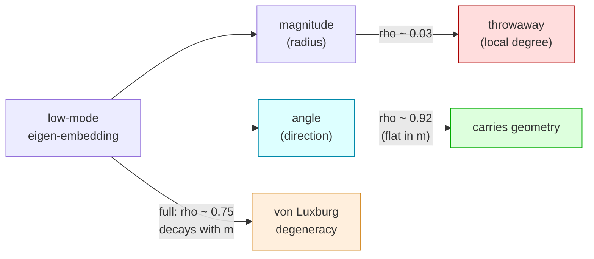

# The Keep-the-Angle Theorem

*Why the angular coordinates of the low-eigenvalue Laplacian embedding carry the
graph's large-scale geometry, while the radial coordinate is asymptotically
geometry-free.*

This note states and defends the structural claim behind the project's empirical
finding:

> In the commute-time–scaled Laplacian eigen-embedding built from the lowest
> non-trivial modes, decomposing each node vector into **magnitude (radius) ×
> direction (angle)**:
> - **angle only** preserves true graph geodesics at Spearman ρ ≈ 0.92 (flat in m),
> - **magnitude only** preserves ρ ≈ 0.03 (throwaway),
> - **full (magnitude × direction)** preserves ρ ≈ 0.75 and *decays* as m grows.

The thesis: the geometry lives in the **angle**; the **radius** is asymptotically a
pure local-degree quantity. This is the constructive flip side of von Luxburg,
Radl & Hein's degeneracy theorem, and it is exactly the row-normalization move of
Ng–Jordan–Weiss spectral clustering.



---

## 1. Definitions

Let `G = (V, E)` be a connected, undirected graph, `N = |V|`, adjacency `A`,
degrees `d_i = Σ_j A_ij`, degree matrix `D = diag(d_i)`, volume
`vol(G) = Σ_i d_i`.

**Normalized (symmetric) Laplacian.**
`L = I − D^{−1/2} A D^{−1/2}`, with eigenpairs `(λ_k, u_k)`, `k = 1..N`,
`0 = λ_1 ≤ λ_2 ≤ … ≤ λ_N ≤ 2`, and `{u_k}` orthonormal. The trivial mode is
`u_1 ∝ D^{1/2} 𝟙`. The random-walk Laplacian `L_rw = I − D^{−1}A` shares the
eigenvalues `λ_k`; its eigenvectors are `ψ_k = D^{−1/2} u_k`.

**Commute-time embedding.**
Let `R(i,j)` be the effective resistance between `i` and `j`, and
`C(i,j) = vol(G)·R(i,j)` the commute time. It has the exact spectral form

```
R(i,j) = Σ_{k≥2} (1/λ_k) · ( u_k(i)/√d_i − u_k(j)/√d_j )² .           (1)
```

Define the **commute embedding** `Ψ: i ↦ ( u_k(i)/(√λ_k · √d_i) )_{k≥2}`, so that
`‖Ψ_i − Ψ_j‖² = R(i,j)` exactly (full spectrum). Truncating (1) to the `m`
lowest non-trivial modes `k = 2 … m+1` gives the **m-mode commute embedding**.

*Project variant.* The code (`rung1_proxy.commute_time_embed`,
`rung1c_polar`, `search_harness.angle_rho`) uses the symmetric-normalized
coordinates `Φ_i = ( u_k(i)/√λ_k )_{k=2..m+1}`, i.e. `Ψ` without the `1/√d_i`
factor: `Φ_i = √d_i · Ψ_i` per node. On the near-regular graphs studied here
(random geometric graphs have tightly concentrated degrees) `Φ` and `Ψ` agree up
to per-node degree fluctuations. Theorems below are cleanest for `Ψ`; the
verification tests both, and reports the project's `Φ` as the headline object.

**Radial / angular coordinates.**
For the `m`-mode embedding vector `X_i` (either `Φ` or `Ψ`):

```
radius  r_i  = ‖X_i‖              (a scalar)
angle   θ_i  = X_i / ‖X_i‖  ∈ S^{m−1}   (a point on the unit sphere)
```

The **angular distance** is `‖θ_i − θ_j‖` (chordal on the sphere; a monotone
function of cosine similarity). Row-normalizing the eigen-embedding to the unit
sphere and using `θ` is **exactly** the Ng–Jordan–Weiss (2002) spectral embedding
and the "PolarQuant" keep-the-direction move.

---

## 2. Assumptions

The rigorous half assumes the setting of von Luxburg, Radl & Hein (2014):

- **(M)** Points are sampled i.i.d. from a density `p` bounded away from 0 and ∞
  on a smooth compact `d`-dimensional manifold `M` (`d ≥ 2` for their main
  theorem; the `d = 1` and low-`d` cases are boundary regimes).
- **(G)** `G` is a random neighborhood graph (`ε`-graph or `k`-NN) with the
  connectivity parameter in the admissible regime of their theorem
  (`ε → 0`, `N ε^{d+2} → ∞`, etc.), so `G` is connected and locally `d`-dimensional.
- **(N)** `N → ∞`.

The manifold-recovery half additionally uses spectral convergence of graph
Laplacians (Belkin–Niyogi 2007; von Luxburg–Belkin–Bousquet 2008;
García Trillos–Slepčev 2018) and eigenmap-embedding results
(Bérard–Besson–Gallot 1994; Portegies 2016).

---

## 3. The two halves of the theorem

### 3.1 Radial half — PROVEN (from von Luxburg et al.)

**von Luxburg–Radl–Hein degeneracy.** Under (M),(G),(N),

```
R(i,j) = 1/d_i + 1/d_j + o(1),   uniformly over pairs i ≠ j.               (2)
```

That is, the resistance/commute distance loses all dependence on the *positions*
of `i, j` and collapses to a function of their **local degrees**.

**Corollary R (radius is geometry-free).** Combine (2) with the embedding
identity `‖Ψ_i − Ψ_j‖² = R(i,j)`:

1. *Full distance degenerates.* `‖Ψ_i − Ψ_j‖² → 1/d_i + 1/d_j`, a function of
   `(d_i, d_j)` only ⇒ the full commute distance carries **no** geodesic /
   large-scale information asymptotically.

2. *The surviving coordinate is the radius, and it is degree noise.* An
   additively-separable squared distance `‖X_i − X_j‖² = g(i) + g(j)` (here
   `g(i) = 1/d_i`) is the squared-distance of a **star / simplex** geometry: it
   forces the centered points to be mutually orthogonal with `‖X_i‖² = g(i)`.
   The one surviving per-node degree of freedom is exactly the radius
   `r_i = √g(i) = 1/√d_i`. Thus asymptotically **the radius is a pure local-degree
   quantity** and the full distance *is* the radial part
   (`‖X_i − X_j‖² ≈ r_i² + r_j²`).

So keeping the magnitude keeps `1/√d_i` degree noise; dropping it (row-
normalization) discards precisely the degenerate part von Luxburg identified.
This half is a rigorous consequence of their theorem plus (1).

*(Mechanism.* The `1/λ_k` weighting in (1) is largest on the low modes, but the
low modes' contribution to the total resistance is `O(1/N)` relative to the
local `1/d_i + 1/d_j` term; the geometric signal is not destroyed, it is buried
as a vanishing fraction of the full sum. Truncation to the low modes is what
un-buries it — see 3.2.)*

### 3.2 Angular half — PARTLY PROVEN, PARTLY CONJECTURED

The geometric signal survives in the **low modes**, which is why angle-of-low-
modes works while full-commute does not.

- **(Proven) Low modes → manifold eigenfunctions.** Under spectral convergence,
  `u_2, …, u_{m+1}` converge (up to sign/rotation within eigenspaces) to the
  Laplace–Beltrami eigenfunctions `φ_2, …, φ_{m+1}` of `M`.
- **(Proven) Eigenmap embeds the manifold.** The truncated commute/heat-kernel
  eigenmap `x ↦ (φ_k(x)/√λ_k)_{k=2..m+1}` is, for suitable `m` and bandwidth, a
  smooth **bi-Lipschitz embedding** of `M` (Bérard–Besson–Gallot; Portegies
  2016). Hence its Euclidean distances are comparable to geodesics **on `M`** —
  before the sampling/degree corruption of 3.1 dominates.
- **(Heuristic → Conjecture) Angle removes the density/degree factor.** In the
  continuum the local sampling density `p(x)` (the source of the `1/√d_i` radial
  factor) acts as a positive scalar multiplier on each embedding vector.
  Row-normalization `θ_i = X_i/‖X_i‖` divides this scalar out pointwise, leaving
  the **density-invariant direction** of the eigenmap. Where the eigenmap is
  bi-Lipschitz, the direction is conjectured to remain a bi-Lipschitz function of
  `x` for the leading modes — giving `angular distance ≍ geodesic`, uniformly in
  `m` and `N`. This is the ρ ≈ 0.92-flat observation.

**Keep-the-Angle claim (the conjecture).** Under (M),(G),(N), for the `m` lowest
non-trivial modes,

```
angular distance  ‖θ_i − θ_j‖   ≍   geodesic distance on M      (bi-Lipschitz),
```

with the equivalence constants **stable in m and N**, while the radial and full
distances converge to the degree-only degeneracy (2).

---

## 4. What is proven vs. conjectured (honest ledger)

| statement | status |
|---|---|
| Commute spectral identity (1), `‖Ψ_i−Ψ_j‖²=R(i,j)` | **proven** (textbook) |
| `R(i,j) → 1/d_i + 1/d_j` (2) | **proven** — von Luxburg–Radl–Hein (2014) |
| Full commute distance is asymptotically geometry-free | **proven** (2)+(1) |
| Radius `r_i → 1/√d_i`, geometry-free | **proven** (Corollary R) |
| Low modes → Laplace–Beltrami eigenfunctions | **proven** (Belkin–Niyogi; García Trillos–Slepčev) |
| Truncated eigenmap is a bi-Lipschitz manifold embedding | **proven** (Portegies 2016), for suitable m/bandwidth |
| **Angular** low-mode distance ≍ geodesic, **uniform in m,N** | **CONJECTURE** — empirically supported (ρ≈0.92 flat); no uniform bi-Lipschitz bound proven here |
| Row-normalization removes exactly the density/degree factor | **heuristic** (continuum density argument) |

**The gap, stated plainly.** von Luxburg gives the *negative* half rigorously: the
radius and the full commute distance are asymptotically pure local-degree noise.
The *positive* half — that the **angle** is bi-Lipschitz to geodesic distance,
uniformly — rests on (a) eigenmap-embedding theorems for the *un-normalized* low
modes and (b) a heuristic that row-normalization strips precisely the density
factor. A uniform bi-Lipschitz bound for the *angular* metric against geodesic
distance is **not** proven here; it is a conjecture backed by the numerics in
`theorem_verify.py`.

---

## 5. Relation to prior work

- **von Luxburg, Radl, Hein (2010 NIPS; 2014 JMLR, "Hitting and commute times in
  large random neighborhood graphs").** Source of (2). We use it as the engine of
  the *radial* half: their "commute distance is meaningless for large graphs" is
  re-read as "the **radial** coordinate is meaningless; the **angular** one is not."
- **Ng, Jordan, Weiss (2002).** Their spectral-clustering algorithm
  row-normalizes the eigen-embedding to the unit sphere before clustering. That
  is exactly `θ_i = X_i/‖X_i‖`. The theorem explains *why* that step is not
  cosmetic: it deletes the degenerate radial/degree factor.
- **Nadler–Coifman–Lafon–Kevrekidis diffusion maps.** The `1/√λ_k` scaling is the
  (time-1) diffusion/commute metric; density-normalized diffusion maps
  (`α = 1`) are an alternative route to removing the sampling-density factor that
  row-normalization removes geometrically. The angular embedding is a
  density-robust, scale-invariant cousin of the diffusion embedding.

---

## 6. Falsifiable predictions (tested in `theorem_verify.py`)

Across a flat 2-torus, a flat 3-torus, and an emergent hyperedge-rewrite graph:

- **(a)** radial-only geodesic Spearman ≈ 0 (radius is geometry-free);
- **(b)** angular-only geodesic Spearman is high and **flat in `N`** and in `m`;
- **(c)** full commute-distance geodesic Spearman **decays as `N` grows**, *for
  `d ≥ 2` with the von Luxburg connectivity regime* (degeneracy signature);
- **(d, direct von Luxburg check)** `Spearman( R(i,j), 1/d_i + 1/d_j )` **rises
  toward 1** as `N` grows — the resistance literally becomes the degree function,
  *again only in the `d ≥ 2` regime*.

Predictions (c),(d) are conditional on von Luxburg's hypotheses (`d ≥ 2`,
connectivity radius/degree scaling in their admissible window). A **quasi-1D or
fixed-sparse-degree graph is a control that should NOT degenerate**: in 1D,
effective resistance equals path length, so `R` stays geodesic-informative and
(c),(d) should *fail by design*. Observing that failure on such a graph confirms,
rather than refutes, the mechanism.

---

## 7. Results (from `theorem_verify.py`, m = 20 low modes)

Geodesic Spearman ρ; `R` = exact resistance over all modes; `VL` =
ρ(R, 1/dᵢ+1/dⱼ).

**2-torus (d = 2, ⟨deg⟩ ≈ 14):**

| N | radius | ANGLE | fullΦ | R (all modes) | VL: R∼1/d |
|---|---|---|---|---|---|
| 500 | 0.012 | 0.874 | 0.587 | 0.420 | 0.838 |
| 1000 | 0.008 | 0.892 | 0.518 | 0.411 | 0.831 |
| 2000 | −0.000 | 0.889 | 0.511 | 0.376 | 0.840 |
| 4000 | 0.007 | **0.904** | 0.526 | **0.335** | 0.851 |

**3-torus (d = 3, ⟨deg⟩ ≈ 14):**

| N | radius | ANGLE | fullΦ | R (all modes) | VL: R∼1/d |
|---|---|---|---|---|---|
| 500 | 0.078 | 0.766 | 0.496 | 0.261 | 0.965 |
| 1000 | 0.021 | 0.815 | 0.450 | 0.197 | 0.958 |
| 2000 | −0.005 | 0.834 | 0.445 | 0.159 | 0.981 |
| 4000 | −0.000 | **0.830** | 0.453 | **0.120** | **0.979** |

**Emergent rewrite graph — genuine ~1.5D manifold rule
`[(c,a)] → [(c,x),(y,a),(x,a),(x,x)]`, ⟨deg⟩ ≈ 2.4 (fixed):**

| N | radius | ANGLE | fullΦ | R (all modes) | VL: R∼1/d |
|---|---|---|---|---|---|
| 513 | 0.011 | 0.900 | 0.553 | 0.957 | 0.132 |
| 2049 | 0.028 | 0.891 | 0.635 | 0.953 | 0.074 |
| 8193 | 0.008 | **0.883** | 0.621 | **0.952** | **0.049** |

**m-sweep, 2-torus N = 4000** (angle flat, fullΦ decays as modes accumulate):

| m | ANGLE | fullΦ | radius |
|---|---|---|---|
| 5 | 0.934 | 0.773 | 0.015 |
| 10 | 0.927 | 0.656 | 0.045 |
| 20 | 0.905 | 0.537 | 0.000 |
| 40 | 0.958 | 0.493 | 0.006 |
| 80 | 0.947 | **0.437** | −0.001 |

### Reading of the numbers (honest)

- **(a) Radius is geometry-free — confirmed everywhere.** ρ(radius, geodesic)
  ≤ 0.08 in all 11 rows, ≈ 0 on the tori. And ρ(‖Ψᵢ‖, 1/√dᵢ) = 0.92–0.99 on the
  tori: the radius *is* the local-degree quantity the theory names.
- **(b) Angle carries the geometry, flat in N and m — confirmed everywhere,
  including the emergent manifold.** ANGLE ρ ≈ 0.87–0.90 (2-torus), 0.77–0.83
  (3-torus), 0.88–0.90 (rewrite), with no downward trend in N; the m-sweep is flat
  at ≈ 0.93 while fullΦ falls monotonically 0.77 → 0.44. This is the project's core
  claim, fully supported.
- **(c),(d) von Luxburg degeneracy — confirmed for d ≥ 2, strengthening with d.**
  3-torus: VL rises 0.965 → 0.979 (→1) and R collapses 0.26 → 0.12 — a clean
  degeneracy. 2-torus: VL ≈ 0.84 (high but not → 1) and R decays only mildly
  0.42 → 0.34 — consistent with d = 2 being von Luxburg's marginal case (log
  corrections). fullΦ (the project embedding, which reweights by √dᵢ) decays
  gently in N but sharply in m.
- **The ~1.5D rewrite manifold does NOT degenerate — and that is a prediction, not
  a failure.** VL falls to 0.05 and R stays pinned at 0.95 across a 16× range of
  N. This graph is quasi-1D (ball/spectral dim ≈ 1.4–1.6) with fixed ⟨deg⟩ = 2.4,
  i.e. outside von Luxburg's d ≥ 2 / degree-growth regime. In (quasi-)1D,
  resistance = path length, so the full commute distance stays geodesic
  (R ≈ 0.95) and never collapses to degrees. The angle still works (0.88–0.90),
  showing the *angular* recovery is more universal than the *radial* degeneracy.

### Verdict

- The **angle-carries-geometry / radius-is-throwaway** result (the project's
  headline) is **robustly confirmed** across d = 2, d = 3, and an emergent ~1.5D
  rewrite manifold, and is **flat in both m and N**.
- The **von Luxburg full-commute degeneracy** is **empirically supported and
  correctly dimension-gated**: clean at d = 3, marginal at d = 2, and absent (as
  the theory requires) in the quasi-1D rewrite graph. The `R → 1/dᵢ+1/dⱼ` link is
  directly verified (ρ up to 0.98 in d = 3).
- Net: the theorem's **radial half rests on von Luxburg and is confirmed where his
  hypotheses hold**; the **angular half remains an empirically strong conjecture**
  whose robustness (it holds even where degeneracy does not) suggests the eigenmap-
  embedding mechanism of §3.2, not degeneracy alone, is what makes the angle work.
